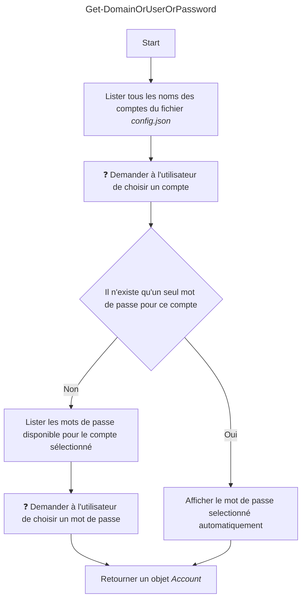
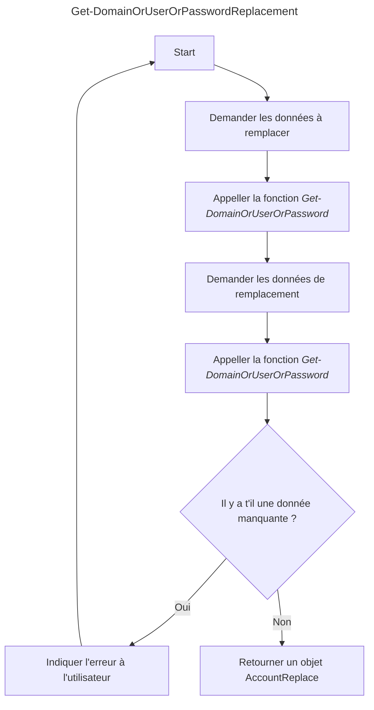

# Presentation

```SvcPasswordUpdater``` is intended to update passwords from **filesystem** and **IIS configurations**.

# Architecture

* ```SvcPasswordUpdater``` : script principal listant les différentes tâches que l'utilisateur peut executer.
    * Lister les pools d'applications IIS
    * Editer le compte des pools d'applications IIS
    * Rechercher des occurences du nom du compte de service ou du mot de passe dans tous les fichiers du lecteur selectionné
    * Rechercher des occurences du nom du compte de service ou du mot de passe dans les fichiers repertoriés dans le *datafiles* de la machine
    * Remplacer le nom du compte et/ou le mot de passe dans les fichiers repertoriés dans le *datafiles* de la machine

* ```Modules```
    * ```IIS```
    * ```Filesystem```
        * ```Get-DomainOrUserOrPassword```
        * ```Get-DomainOrUserOrPasswordReplacement```
* ```Config``` :
    * ```Domains``` : Liste de domaines
    * ```Users``` : Liste d'utilisateurs
    * ```Passwords``` : Liste de mots de passe 

# Prompts



